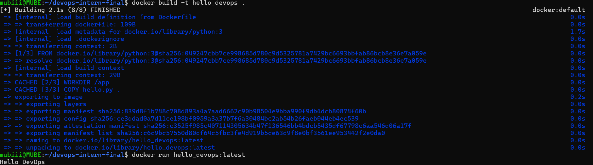

DevOps Tools Hands-On

Author: Mubendiran K

This mini-project demonstrates a complete DevOps workflow using Git, Docker, CI/CD, Nomad, and monitoring with Grafana + Loki. The goal is simple: try out the full DevOps pipeline end-to-end.

📝 Script

A bash script was created to fetch system information and executed successfully.

Proof:

🐳 Docker

A Dockerfile was created to containerize hello.py.
The image was built locally and pushed to GitHub Container Registry.

Proof:

⚙️ CI/CD – GitHub Actions

A CI test workflow was added using GitHub Actions to validate the Docker image.

Status Badge:

🚀 Nomad Deployment

A Nomad job specification is included for deploying the containerized application.

Location: nomad/hello.nomad

Configuration:

Job Type: service

Driver: Docker

Resources: 100 MHz CPU, 128 MB memory

Proof:

📊 Grafana + Loki (Monitoring)

Monitoring setup includes:

Running Loki in Docker

Forwarding container logs

Querying logs via API or Grafana dashboard

Proof:
